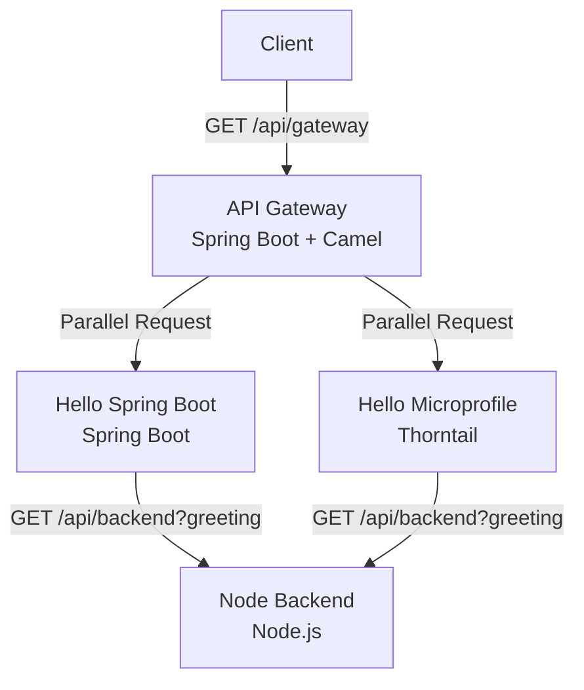

# Microservices Project

Project created based on the book <b>Microservices for Java Developers <i>by Rafael Benevides & Christian Posta</i></b>.

## System Design



### node_backend

Microservice that exposes the API: `GET /api/backend?greeting={greeting}`.<br/>
This API should receive query Param greeting and use its value, together server IP and current time in milliseconds, to compose a JSON object and return it on response.

### hello_springboot

Microservice that exposes the API: `GET /api/greeting`.<br/>
This API should load value `greeting.saying` from microservice's `application.properties` and use it to invoke **node_backend**'s API.<br/>
<br/>
Created using `Spring Boot 2.3.3.RELEASE`. 

### hello_microprofile

Microservice that exposes the API: `GET /api/greeting`.<br/>
This API should load value `greeting.saying` from microservice's `microprofile-config.properties` and use it to invoke **node_backend**'s API.<br/>
<br/>
Created using `MicroProfile/Thorntail 2.7.0.Final`. 

### api_gateway

API Gateway Microservice that exposes API: `GET /api/gateway`.<br>
When called, this API should dispatch, parallelally, one request for each microservices: hello_springboot and hello_microprofile.
Both responses should be accumulate in an ArrayList, the response for this API.<br>
<br>
Created using `Spring Boot 2.3.3.RELEASE` and `Apache Camel 3.4.3`.

## Setup Instructions

1. **Start Node Backend**:
   Navigate to the `node-backend` directory and run:
   ```bash
   npm install
   npm start
   ```
   Runs on port 8000 by default.

2. **Start Hello Spring Boot**:
   Navigate to the `hello-springboot` directory and run:
   ```bash
   ./mvnw spring-boot:run
   ```
   Runs on port 8080 by default.

3. **Start Hello Microprofile**:
   Navigate to the `hello-microprofile` directory and run:
   ```bash
   ./mvnw thorntail:run
   ```
   Runs on port 8081 by default.

4. **Start API Gateway**:
   Navigate to the `api-gateway` directory and run:
   ```bash
   ./mvnw spring-boot:run
   ```
   Runs on port 8082 by default.

## Testing

Each microservice comes with unit and integration tests to ensure reliable functionality:

- **api-gateway**: Contains Spring Boot context loading tests.
- **hello-springboot**: Includes Spring Boot application context tests.
- **hello-microprofile**: To be added.
- **node-backend**: To be added.

To run the Java tests, use `./mvnw test` inside each Java project directory.

